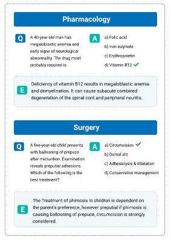

<h1 align="center">MedMCQA </h1>

<p align="center">
  
</p>

<h3 align="center">MedMCQA : A Large-scale Multi-Subject Multi-Choice Dataset for Medical domain Question Answering</h3>

A large-scale, Multiple-Choice Question Answering (MCQA) dataset designed to address realworld medical entrance exam questions. 

The MedMCQA task can be formulated as X = {Q, O} where Q represents the questions in the text, O represents the candidate options, multiple candidate answers are given for each question O = {O1, O2, ..., On}. The goal is to select the single or multiple answers from the option set.

If you would like to use the data or code, please cite the paper:

```
@InProceedings{pmlr-v174-pal22a,
  title = 	 {MedMCQA: A Large-scale Multi-Subject Multi-Choice Dataset for Medical domain Question Answering},
  author =       {Pal, Ankit and Umapathi, Logesh Kumar and Sankarasubbu, Malaikannan},
  booktitle = 	 {Proceedings of the Conference on Health, Inference, and Learning},
  pages = 	 {248--260},
  year = 	 {2022},
  editor = 	 {Flores, Gerardo and Chen, George H and Pollard, Tom and Ho, Joyce C and Naumann, Tristan},
  volume = 	 {174},
  series = 	 {Proceedings of Machine Learning Research},
  month = 	 {07--08 Apr},
  publisher =    {PMLR},
  pdf = 	 {https://proceedings.mlr.press/v174/pal22a/pal22a.pdf},
  url = 	 {https://proceedings.mlr.press/v174/pal22a.html},
  abstract = 	 {This paper introduces MedMCQA, a new large-scale, Multiple-Choice Question Answering (MCQA) dataset designed to address real-world medical entrance exam questions. More than 194k high-quality AIIMS & NEET PG entrance exam MCQs covering 2.4k healthcare topics and 21 medical subjects are collected with an average token length of 12.77 and high topical diversity. Each sample contains a question, correct answer(s), and other options which requires a deeper language understanding as it tests the 10+ reasoning abilities of a model across a wide range of medical subjects & topics. A detailed explanation of the solution, along with the above information, is provided in this study.}
}
```

[](https://opensource.org/licenses/MIT)
[](https://github.com/medmcqa/medmcqa/commits/main)
[](http://makeapullrequest.com)


## Dataset Description

|     | Links  | 
| :-------------: |:-------------:|
| **Homepage:** |  https://medmcqa.github.io  | 
| **Repository:** |  https://github.com/medmcqa/medmcqa  | 
| **Paper:** |  https://arxiv.org/abs/2203.14371  | 
| **Leaderboard:** |  https://paperswithcode.com/dataset/medmcqa  |
| **Point of Contact:** |  [Aaditya Ura](mailto:aadityaura@gmail.com), [Logesh](mailto:logesh.umapathi@saama.com)  |

## Dataset Summary

MedMCQA is a large-scale, Multiple-Choice Question Answering (MCQA) dataset designed to address real-world medical entrance exam questions.

MedMCQA has more than 194k high-quality AIIMS & NEET PG entrance exam MCQs covering 2.4k healthcare topics and 21 medical subjects are collected with an average token length of 12.77 and high topical diversity.

Each sample contains a question, correct answer(s), and other options which require a deeper language understanding as it tests the 10+ reasoning abilities of a model across a wide range of medical subjects & topics. A detailed explanation of the solution, along with the above information, is provided in this study.

MedMCQA provides an open-source dataset for the Natural Language Processing community.
It is expected that this dataset would facilitate future research toward achieving better QA systems.
The dataset contains questions about the following topics:

- Anesthesia
- Anatomy
- Biochemistry
- Dental
- ENT
- Forensic Medicine (FM)
- Obstetrics and Gynecology (O&G)
- Medicine
- Microbiology
- Ophthalmology
- Orthopedics
- Pathology
- Pediatrics
- Pharmacology
- Physiology
- Psychiatry
- Radiology
- Skin
- Preventive & Social Medicine (PSM)
- Surgery

## Requirements

`pip3 install -r requirements.txt`

## Data Download and Preprocessing

download the data from below link

data : https://drive.google.com/uc?export=download&id=15VkJdq5eyWIkfb_aoD3oS8i4tScbHYky

## Experiments code

To run the experiments mentioned in the paper, follow the below steps
- Clone the repo
- Install the dependencies 

`pip3 install -r requirements.txt`

- Download the data from google drive link
- Unzip the data
- run below command with the data path

` python3 train.py --model bert-base-uncased --dataset_folder_name "/content/medmcqa_data/" `

## Supported Tasks and Leaderboards

multiple-choice-QA, open-domain-QA: The dataset can be used to train a model for multi-choice questions answering, open domain questions answering. Questions in these exams are challenging and generally require deeper domain and language understanding as it tests the 10+ reasoning abilities across a wide range of medical subjects & topics.

## Languages

The questions and answers are available in English.

## Dataset Structure

### Data Instances

```
{
    "question":"A 40-year-old man presents with 5 days of productive cough and fever. Pseudomonas aeruginosa is isolated from a pulmonary abscess. CBC shows an acute effect characterized by marked leukocytosis (50,000 mL) and the differential count reveals a shift to left in granulocytes. Which of the following terms best describes these hematologic findings?",
    "exp": "Circulating levels of leukocytes and their precursors may occasionally reach very high levels (>50,000 WBC mL). These extreme elevations are sometimes called leukemoid reactions because they are similar to the white cell counts observed in leukemia, from which they must be distinguished. The leukocytosis occurs initially because of the accelerated release of granulocytes from the bone marrow (caused by cytokines, including TNF and IL-1) There is a rise in the number of both mature and immature neutrophils in the blood, referred to as a shift to the left. In contrast to bacterial infections, viral infections (including infectious mononucleosis) are characterized by lymphocytosis Parasitic infestations and certain allergic reactions cause eosinophilia, an increase in the number of circulating eosinophils. Leukopenia is defined as an absolute decrease in the circulating WBC count.",
    "cop":1,
    "opa":"Leukemoid reaction",
    "opb":"Leukopenia",
    "opc":"Myeloid metaplasia",
    "opd":"Neutrophilia",
    "subject_name":"Pathology",
    "topic_name":"Basic Concepts and Vascular changes of Acute Inflammation",
    "id":"4e1715fe-0bc3-494e-b6eb-2d4617245aef",
    "choice_type":"single"
}
```
### Data Fields

- `id` : a string question identifier for each example
- `question` : question text (a string)
- `opa` : Option A
- `opb` : Option B
- `opc` : Option C
- `opd` : Option D
- `cop` : Correct option (Answer of the question)
- `choice_type` : Question is `single-choice` or `multi-choice`
- `exp` : Expert's explanation of the answer
- `subject_name` : Medical Subject name of the particular question
- `topic_name` : Medical topic name from the particular subject

### Data Splits

The goal of MedMCQA is to emulate the rigor of real word medical exams. To enable that, a predefined split of the dataset is provided. The split is by exams instead of the given questions. This also ensures the reusability and generalization ability of the models. 

- The training set of MedMCQA consists of all the collected mock & online test series. 
- The test set consists of all AIIMS PG exam MCQs (years 1991-present). 
- The development set consists of NEET PG exam MCQs (years 2001-present) to approximate real exam evaluation.

Similar questions from train , test and dev set were removed based on similarity. The final split sizes are as follow:

|                             | Train   | Valid | Test |
| -----                       | ------ | ----- | ---- |
| Question #| 182,822 |  6,150 | 4,183|
| Vocab       | 94,231 |  11,218 | 10,800 |
| Max Ques tokens    | 220  |  135| 88 |
| Max Ans tokens | 38 | 21 | 25 |

## Model Submission and Test Set Evaluation

To preserve the integrity of test results, we do not release the test set's ground-truth to the public. Instead, we require you to
use the test-set to evaluate the model and send the predictions along with unique question id `id` in csv format to below google form (Fill the google form and upload the files there)

Example :

| id    | Prediction (correct option)  | 
| :-------------: |:-------------:|
| 84f328d3-fca4-422d-8fb2-19d55eb31503 |  2  | 
| bb85e248-b2e9-48e8-a887-67c1aff15b6d |  3  | 


### Submission checklist:

1) Make sure your file format is `.csv`
2) Please check your predictions; the answer index starts with 1, not with 0; all correct options should be in the range of `[ 1, 2, 3, 4 ]`
3) We accept submissions only via the below google form.
4) Make sure there are only two columns named `id`  and `Prediction (correct option).`

### Submission Resources

- Google form for model submission : https://forms.gle/xLJHNbuvaRa2FXbD8
- For any issue or query           : medmcqa [at] gmail.com
